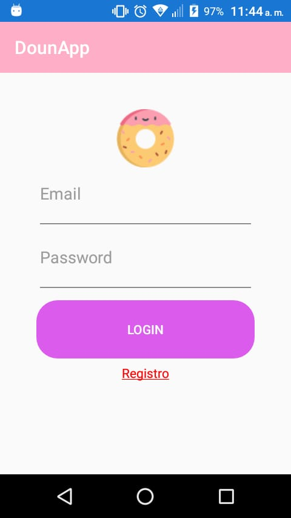
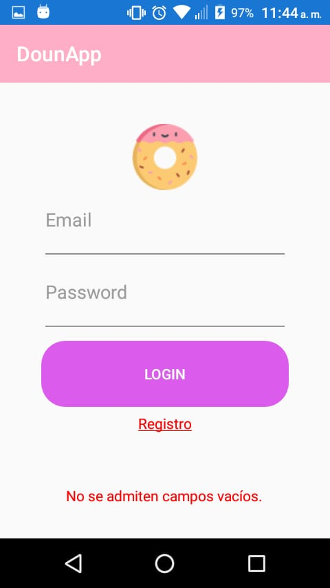
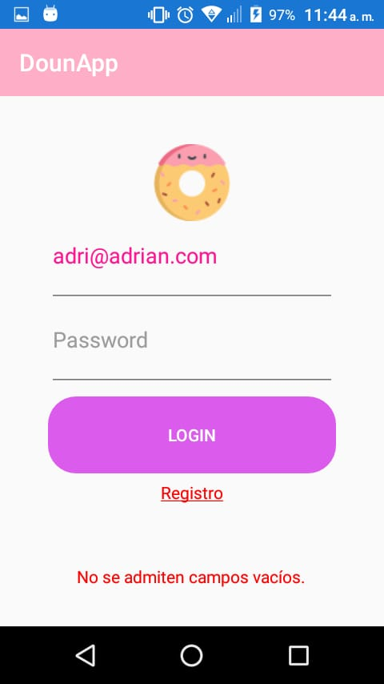
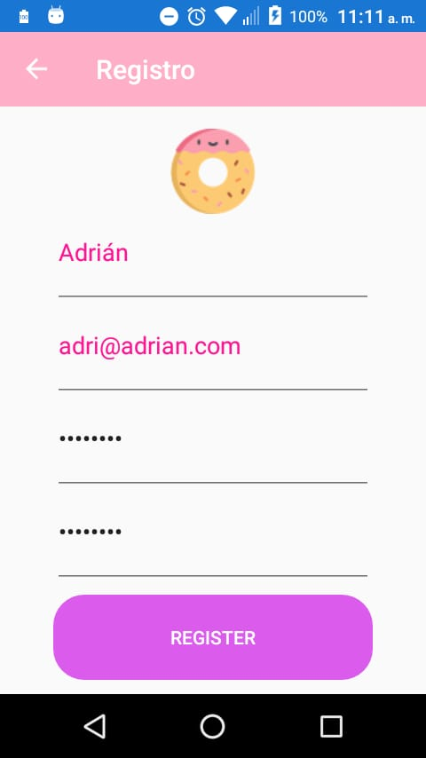
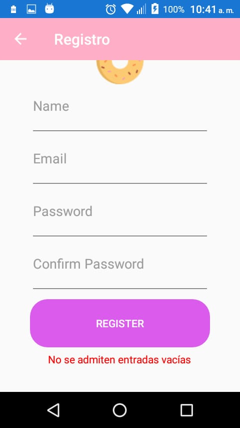
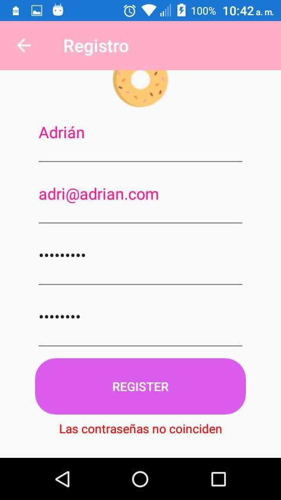
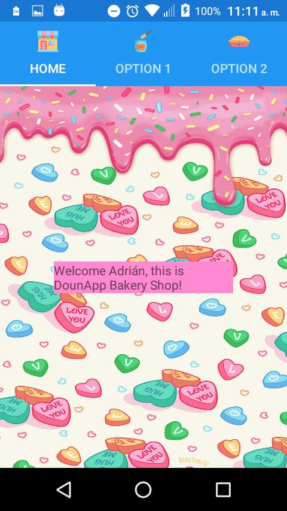

# Tarea2MAD
Segunda asignación de Desarrollo de Aplicaciones móviles

En esta asignación tuvimos que poner en práctica Data Binding, MVVM y navgación entre páginas.

El proyecto se encuentra alojado en el branch DevBranch.

Aquí algunas imágenes de ejemplo:

**Página de Login**\

**Página de Login al dejar campos en blanco**

**Página de Login con un solo campo en blanco**

**Página de Registro satisfactorio**

**Página de Registro-Correo inválido**

**Página de Registro-Campos Vacíos**

**Páginas de Registro-Incorcondancia de contraseñas**

**TabbedPag-HomePage**

